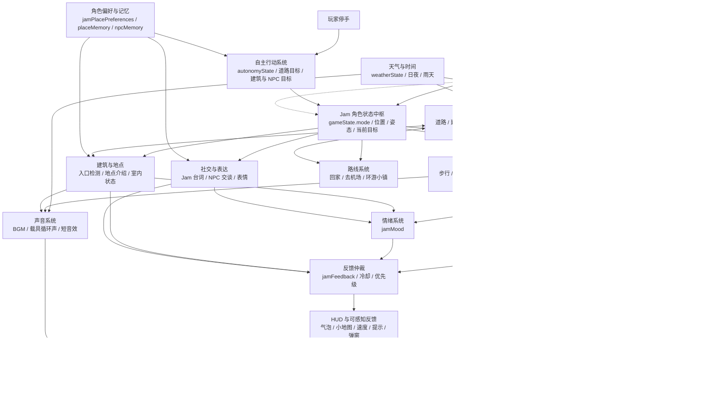

## 一句话概述

Jam City Prototype 是一个运行在浏览器里的 3D 城市漫游原型：玩家控制 Jam 在一座风格化小镇中步行、开车、骑摩托、滑滑板、驾驶直升机，和 NPC、建筑、天气、声音、路线、装扮等系统产生连续互动。

它当前不是传统意义上的关卡赛车，而更接近一个“有交通工具的轻生活城市沙盒”：驾驶只是入口，核心体验是 Jam 在城市里移动、观察、遇见、表达和自主行动。

## 核心创新性

### 1. 把“交通工具驾驶”变成角色生活方式

原型不是只做一辆车的操控，而是把车、摩托、滑板、直升机、步行统一到同一个角色状态系统里。玩家可以在城市里切换行动方式，Jam 的位置、姿态、速度 UI、音效、碰撞能力和操作提示会随状态改变。

### 2. 角色不是皮肤，而是会表达的主体

Jam 有头顶对话气泡、表情系统、驾驶反馈台词、NPC 对话回应、室内事件反馈。角色会根据启动、转弯、碰撞、踢飞障碍、收集星星、进入建筑、路过地点等状态主动说话，让移动过程变成“和角色一起逛城市”。

### 3. 城市是可进入、可观察、可自动巡游的空间

每个建筑都有不同功能、介绍文案、室内状态和 NPC 遇见逻辑。靠近建筑会触发观察视角，按 `E` 查看和进入。路线系统支持回家、去机场、环游小镇，并且环游路线会经过 NPC 打招呼。

### 4. 自主行动让角色在玩家停手后继续“活着”

用户无操作超过 5 秒后，Jam 会自动选择行为：走路、上交通工具、开车、进入/离开建筑、绕开障碍、沿道路行动。它不是完全静止等待输入，而是保持小镇生活流动。

### 5. 用角色偏好驱动城市行为

Jam 不再只是随机选择地点。系统把它的人设转成地点偏好：更喜欢炸鸡、气泡水、书店、天台、高处和安静空间；对过度社交、作业、镜头太近等场景会更保守。洋葱设定已降为低频性格点，不再主导地点选择和文案。

### 6. 低成本程序化 3D 原型承载较多系统

当前大量模型来自 Three.js 几何体组合，而不是重资产 GLB。这样可以快速验证城市玩法、角色姿态、UI、声音、AI 行为和多交通工具交互，再决定哪些资产值得进入 Blender/美术管线。

## 当前玩家可感知能力

### 角色与基础移动

- Jam 作为主角出现在场景中，有小龙形象、翅膀、头部、身体、四肢和表情。
- 支持步行移动，`WASD` / 方向键控制方向。
- 步行状态下按 `Space` 可跳跃，支持原地起跳和带方向跳。
- 支持鼠标点击地面后自动前往目标点，并在目标处显示视觉引导点。
- 步行时可以踢飞小障碍物，但力度比车辆更小。
- 走路时可以收集星星。
- 头顶显示角色名字，Jam 名字样式与 NPC 区分。

### 多交通工具系统

- 汽车：支持驾驶、转向、倒车、漂移、碰撞小障碍、车轮旋转、车牌、方向盘联动。
- 摩托：支持骑行、转向、轮胎细节、轮子滚动、撞飞小障碍。
- 滑板：支持滑行、转向、撞飞小障碍、按 `Space` 跳跃。
- 直升机：支持起飞、飞行、升降、落地后下机。
- `F` 专门负责上/下交通工具。
- `E` 专门负责建筑交互：查看、进入、离开。
- 路边随机停放不同颜色的汽车、摩托、滑板，Jam 可以拾取并使用。
- 不同交通工具有不同速度、操作反馈、碰撞能力和声音层。

### 城市与地图

- 小镇包含道路、草坪、建筑、机场、路灯、红绿灯、路边障碍、星星收集点、NPC 活动点。
- 道路已经被重新绘制为更连续的路网，支持车辆真实漫游。
- 中央 Home / Jam 家附近有告示牌和家门口台阶。
- 可进入建筑在建筑本身和小地图上有标识。
- 夜晚模式下路灯和红绿灯会亮起。
- 小地图显示道路、建筑、入口、机场、星星、交通工具、玩家位置和朝向。
- 小地图上 Jam 家有专属“屋顶 + J”标识，靠近或进入时会高亮。
- 小地图支持放大、缩小、拖动和中心视图。

### 建筑进入与室内

- 当前每个主要建筑都可进入。
- 靠近建筑时会触发适合观察建筑的镜头角度，按 `Esc` 退出。
- Jam 在交通工具上时不会触发建筑/告示牌自动切镜，避免驾驶视角被打断。
- 按 `E` 可打开地点介绍弹窗，再按 `E` 或点击按钮进入。
- 进入建筑后显示室内 UI，展示 Jam 在该地点做了什么。
- 室内支持 NPC 偶遇。
- 按 `E` 或点击离开按钮可回到室外。
- 建筑之间有差异化主题，例如甜点店、咖啡馆、杂货铺、书店、气泡吧、便当屋、茶室、玩具店、工作室、旅馆、学校、Jam 的家等。

### NPC 与社交

- 城市里有多个风格各异的 NPC。
- NPC 可以步行、开交通工具、骑滑板/摩托或在世界里游玩。
- 每个 NPC 头顶显示名字。
- 左上头像旁有在线 NPC 清单，支持展开收起。
- 点击 NPC 头像可切换到对应 NPC 的拍摄角度，但不接管控制权。
- NPC 会主动和 Jam 打招呼或交谈。
- Jam 会给出对应回应。
- NPC 发言气泡中不重复显示“名字：内容”，名字由头顶标签承担。

### Jam 表达系统

- Jam 有主动说话能力。
- 对话会出现在 Jam 头顶，而不是固定 UI 面板。
- 文案避免过度重复，细小操作不会频繁触发。
- Jam 会对启动、刹车、转弯、碰撞、踢飞障碍、收集星星、进入/离开建筑、特殊地点等事件做短句反馈。
- 表情系统优先作用在 Jam 身上，会根据状态切换 idle、happy、curious 等表现。

### 情绪、记忆与地点偏好

- Jam 有内部情绪状态，例如 calm、joy、awkward、curious、tired、safe。
- 情绪不直接作为大 UI 展示，而是影响台词、表情、地点偏好和反馈优先级。
- Jam 会记得今天来过哪些地点、进入过几次、当时大致情绪。
- NPC 会记得和 Jam 打过招呼、在哪些地方见过、是否看见 Jam 撞过东西。
- 天气会修饰 Jam 的情绪：雨天更安静，夜晚更安心，夕阳更有观察欲。
- 回到 Jam 家或进入 Jam 的天台楼，会触发轻微“回家情绪闭环”，根据今天的星星、NPC、碰撞、天气等生成安心反馈。
- 地点偏好会影响自动漫游：Jam 更容易去 Deli、Belo Bar、Books、Jam 家、Loft、Tea、Shop 等符合人设的地点。
- 洋葱只保留为低频忌口背景，不再高频影响地点偏好和台词。

### 装扮系统

- Jam 当前支持帽子、披风、眼镜三个配件。
- 装扮入口位于头像附近，UI 较轻量。
- 展开后只显示图标，通过 UI 样式区分穿戴/脱下状态。
- 配件状态会同步到 Jam 的不同表现形态。

### 天气与时间

- 支持日间、夕阳、夜晚。
- 支持晴天、雨天。
- 天气 UI 聚合在一个天气图标入口里，展开后全是图标按钮。
- 手动切换天气后一段时间保持用户选择，之后自动回到系统自主运转。
- 天气影响天空、光照、雨效、环境氛围。
- 夜晚会影响城市灯光表现。
- 天气会影响 Jam 的内部情绪、反馈台词和 BGM 氛围层。

### 声音系统

- 有城市漫游 BGM。
- 直升机飞行有额外空气感/旋翼层。
- 室内有更安静的氛围层。
- 汽车、摩托、滑板、直升机有各自循环声音。
- 星星、碰撞、踢飞、上下车/机、进入/离开建筑、UI 点击、装扮切换、说话气泡等都有音效或预留音效反馈。
- 声音设置入口位于 NPC 按钮下方，支持单独开关 BGM 和音效，并调节音量。

### UI 与操作

- 左上角是 Jam 实时 3D 头像。
- 星星 UI 简化为 `★ X/X`。
- 速度只在骑乘/驾驶交通工具后显示，位于下方中间，以无背景悬浮数字呈现。
- 操作提示只显示当前状态可能用得上的键盘提示。
- 右上区域有天气、小地图、路线等模块。
- 菜单展开位置跟随入口，避免不同菜单混在一起。

## 实现机制概览

### 技术栈

- 构建工具：Vite。
- 3D 渲染：Three.js。
- 物理：Rapier3D。
- 动画：GSAP。
- 音频：Howler 依赖存在，当前音频系统主要通过 Web Audio API 生成循环层和短音效。
- 性能监控：stats-gl。
- 调试：页面内暴露 `window.__ARC_DEBUG__`，便于自动化验证姿态、位置、入口和车辆状态。

### 项目结构

当前原型主要集中在：

- `index.html`：页面结构、HUD、菜单、弹窗、室内面板、音量控制、小地图、天气、路线、装扮入口。
- `src/main.js`：核心 3D 场景、世界生成、角色、交通工具、输入、AI、UI、音频、天气、NPC、调试桥。
- `src/styles.css`：界面样式、HUD 布局、面板、气泡、提示、天气/路线/装扮等视觉样式。

这是一个典型的“单文件快速原型”阶段：便于连续迭代，但后续适合拆分成 scene、player、vehicles、npc、ui、audio、weather、navigation 等模块。

### 产品架构示意图

下图按当前产品能力划分 Jam City Prototype 的主要模块关系：玩家操作和系统自主行为共同驱动 Jam 的状态中枢，再由世界模型、角色智能、表现层和反馈层把结果转成可感知体验。

## 详细实现机制

### 1. 场景与渲染

场景使用 Three.js 创建主相机、主渲染器、灯光、阴影和 3D 对象。默认使用 `WebGLRenderer`，保留 WebGPU 实验模式入口。

城市不是从外部模型加载，而是用 Three.js 几何体程序化拼装：

- 地面和草坪使用盒体/平面。
- 道路使用矩形 road 数据。
- 建筑使用组合盒体、屋顶、窗户、招牌、入口标记。
- 交通工具使用 Group + Box/Cylinder/Torus 等几何体组合。
- Jam 和 NPC 也是低多边形组合模型。

这种方式的优点是迭代极快，缺点是资产精细度有限。当前更适合验证“玩法系统”和“体验方向”，不适合直接作为最终美术质量。

### 2. 物理与碰撞

Rapier3D 主要负责车辆刚体、小障碍物刚体和部分固定碰撞体。

汽车使用物理刚体控制：

- 通过线速度和角速度模拟前进、转向、倒车和漂移。
- 轮胎转动、方向盘转动、车身姿态是视觉层跟随物理状态。
- 小障碍物可被车辆撞开。

步行和滑板/摩托更多使用自定义运动逻辑：

- 步行通过位置增量移动，并用自定义障碍规避/解析避免穿模。
- 摩托和滑板使用 `rideableState.speed`、`rideableState.yaw` 计算位置。
- 滑板新增跳跃通过 `skateboardJumpState` 实现视觉高度变化。

### 3. 输入系统

当前输入以键盘、鼠标和 UI 点击组成：

- `WASD` / 方向键：步行、驾驶、骑行、飞行方向。
- `F`：交通工具上下。
- `E`：建筑查看、进入、离开。
- `Space`：步行跳跃、滑板跳跃、汽车漂移、直升机上升。
- `Shift`：直升机下降。
- `R`：汽车复位。
- 鼠标拖动：视角旋转。
- 鼠标滚轮：视角缩放。
- 鼠标点击地面：设置可见范围内的移动目标点。

底部提示不是固定说明书，而是根据 `gameState.mode`、是否在室内、是否靠近入口、是否在直升机等状态动态生成。

### 4. 交通工具状态机

交通工具状态以 `gameState.mode` 为核心：

- `foot`
- `vehicle`
- `motorcycle`
- `skateboard`
- `helicopter`

切换交通工具时，会做这些同步：

- 当前位姿转移到新交通工具。
- 隐藏或显示对应模型。
- 更新 Jam 的坐姿/站姿/骑乘姿态。
- 重置速度、油门、方向、飞行输入等状态。
- 更新相机跟随角度。
- 播放上/下交通工具音效和 Jam 反馈。

这使得“同一个 Jam”可以自然穿梭在多种交通方式之间。

### 5. 角色模型与姿态

Jam 当前是低多边形组合模型，包含头、身体、手臂、脚、翅膀、角、面部表情等部件。

不同状态会调整模型：

- 开车：Jam 坐在车内，方向盘和头部/身体有联动。
- 摩托：Jam 不缩小，身体前倾，手接近车把。
- 滑板：Jam 不缩小，站在滑板上，跳跃时随滑板一起起伏。
- 直升机：Jam 位于舱内，整体飞机放大以避免压缩 Jam。
- 步行：Jam 正常站立，有步态摆动和跳跃。

头像 HUD 使用独立的小型 Three.js 渲染场景，实时渲染 Jam 正面特写。

### 6. 建筑系统

建筑能力由 `enterableBuildingInfo` 这样的数据结构驱动。每个建筑包含：

- 标题。
- 地点功能。
- 主题类型。
- 进入前介绍。
- 进入后行为描述。
- 可能出现的 NPC。

建模时如果建筑存在 enterable 信息，就会：

- 添加入口门、光圈、图标标识。
- 记录入口坐标和入口半径。
- 加入 `worldItems.entrances`。
- 在小地图上绘制入口标记。

交互流程：

1. Jam 靠近入口。
2. `findNearestEntrance()` 判断是否在入口半径内。
3. UI 显示 `E 查看`。
4. 按 `E` 展示地点介绍弹窗。
5. 再按 `E` 或点击按钮进入。
6. `enterBuilding()` 构建/显示室内场景和室内 UI。
7. 按 `E` 或点击按钮离开，回到原位置。

地点偏好由 `jamPlacePreferences` 补充驱动。它把 Jam 的人物设定转成地点权重、进入加成和情绪影响。例如 Deli 更偏“炸鸡和热量吸引”，Belo Bar 更偏“气泡水和夜间氛围”，Books/Tea/Jam/Loft 更偏“安静、高处、安全感”。这些偏好会参与自动漫游的建筑选择，也会补充地点介绍和室内描述。

### 7. 室内与 NPC 偶遇

进入建筑时，会根据建筑主题生成室内状态，并从建筑配置里的 `likelyNpcs` 选择可能出现的 NPC。

室内 UI 被拆成两层信息：

- 进入前：地点介绍，告诉玩家这是哪里。
- 进入后：Jam 做了什么，展示角色行为结果。

这样避免同一类描述在进入前后重复堆叠。

### 8. NPC 系统

NPC 是世界中的独立对象，具有名字、外观、行为类型和移动模式。

当前支持的表现包括：

- 在小镇步行。
- 乘坐小车/摩托/滑板循环移动。
- 出现在建筑室内。
- 通过在线 NPC 清单快速查看。
- 主动向 Jam 发言。
- 等待 Jam 回应。

NPC 交谈通过距离、冷却时间、全局发言间隔和 Jam 当前说话状态控制，避免多人同时刷屏。

### 9. Jam 对话与表情

Jam 的对话不是固定文本框，而是事件驱动：

- 驾驶状态触发：启动、刹车、转向、速度变化。
- 环境触发：路过建筑、进入建筑、离开建筑。
- 交互触发：收集星星、碰撞、踢飞障碍。
- 社交触发：NPC 打招呼后的回应。

每类事件有冷却，避免同一句话连续刷出。文案方向是短、直白、轻幽默，减少过度别扭或重复。

表情系统通过修改 Jam 面部部件的位置、旋转和缩放来实现，配合状态切换到不同表情预设。

### 10. 情绪、记忆与反馈队列

Jam 的情绪系统由 `jamMood` 表示，包含 calm、joy、awkward、curious、tired、safe 等维度。它不是显式数值 UI，而是给台词、表情和地点偏好提供上下文。

反馈系统由 `jamFeedback` 队列管理：

- 每个事件进入队列时带有优先级、冷却和过期时间。
- 高优先级事件如回家、进入建筑、收集星星、碰撞会优先显示。
- 重复事件会通过 `jamFeedback.repeats` 递进文案，例如连续碰撞或连续捡星星会换说法。
- 细小操作会被冷却和重复抑制，避免刷屏。

地点记忆由 `placeMemory` 管理，记录今天访问次数、上次访问时间、当时 Jam 的主要情绪和事件。NPC 关系记忆由 `npcMemory` 管理，记录打招呼次数、熟悉度、见面地点和是否看见 Jam 撞车。

天气和回家闭环也接入这个系统：

- `getWeatherMoodTarget()` 会根据日间、夕阳、夜晚、雨天修正情绪目标。
- 天气变化会入队天气反馈，但有冷却，避免频繁打断。
- `triggerHomeClosure()` 会在 Jam 回到家或进入天台楼时生成安心反馈，并根据当天星星、NPC、碰撞和天气选择台词。

### 11. 自主行动系统

自主行动通过 `autonomyState` 管理：

- 用户无操作超过 5 秒后开始。
- 会根据当前模式选择动作。
- 步行状态更倾向选择道路目标，也会按地点偏好选择建筑、NPC、告示牌或交通工具。
- 交通工具状态以道路行驶为主；如果决定和建筑/NPC/道具互动，会先开到目标附近的路面停靠点，再下车步行过去。
- 室内状态会在室内游走，偶尔离开。
- 遇到目标会完成对应动作，例如上车、进入建筑、看告示牌、和 NPC 打招呼。

自主路径不是完整 NavMesh，而是轻量规则：

- 优先找道路点。
- 通过 `nearestRoadPoint()` 把目标拉回道路。
- 通过 `buildAutonomyWalkRoute()` 生成道路优先的折线路径，最后一小段才离开路面进入互动目标。
- 对建筑、车辆等大障碍做避障。
- 对目标建筑入口有特殊处理，避免想进门时反被建筑避障推开。
- 对告示牌、交通工具、NPC 有互动目标例外，允许最后一小段靠近对象。
- 卡住时会放弃当前目标，切换新目标。
- 自主驾驶大角度转向时优先慢速前进掉头，只有多次卡住才小幅倒车。

### 12. 路线系统

路线系统是用户主动触发的半自动导航：

- 回家。
- 去机场。
- 环游小镇。

路线逻辑会根据当前位置判断是否需要先找交通工具，远距离优先使用合适载具。环游路线会沿小镇道路经过 NPC 并打招呼，最后回到 Jam 家。

它和完全自主行动不同：路线是玩家明确选择的目标，自主行动是玩家停手后的生活流。

### 13. 小地图系统

小地图使用 Canvas 2D 绘制，而不是额外 3D 相机。

绘制内容包括：

- 道路。
- 建筑。
- 可进入入口。
- 机场。
- 告示牌。
- Jam 家专属标识。
- 星星。
- 路边交通工具。
- NPC。
- 玩家当前位置和朝向。
- 当前交通工具状态。

小地图支持：

- 缩放。
- 拖动。
- 中心放大。
- 低倍率回到全图。

这种实现性能成本低，也方便用抽象符号表达城市结构。

### 14. 天气系统

天气由 `weatherState` 和 `weatherPresets` 控制：

- 时段：日间、夕阳、夜晚。
- 天气：晴天、雨天。

系统会更新：

- 天空颜色。
- 灯光强度。
- 环境氛围。
- 雨天效果。
- 夜间路灯/红绿灯发光。

用户手动选择后，会暂时保持；超过保留时间后，自动恢复系统运转。

天气还会影响角色层：

- 雨天、夜晚、夕阳会改变 Jam 情绪目标。
- 天气切换会触发低频 Jam 反馈台词。
- BGM 会根据天气变得更柔和、更低频或更暖。

### 15. 音频系统

音频系统通过 Web Audio API 生成：

- 城市 BGM 循环。
- 室内氛围层。
- 飞行背景层。
- 汽车、摩托、滑板、直升机循环声。
- UI 点击、星星、碰撞、踢飞、上下车、进入建筑、装扮、说话气泡等短音效。

音量控制拆成 BGM 和音效两类，用户可分别开关和调节音量。

### 16. UI 架构

UI 主要在 HTML 中声明，通过 JS 更新状态：

- 头像。
- NPC 菜单。
- 声音设置。
- 天气菜单。
- 小地图。
- 路线菜单。
- 装扮菜单。
- 星星计数。
- 速度浮层。
- 操作提示。
- 地点介绍弹窗。
- 室内面板。
- Jam 和 NPC 的头顶气泡。

整体方向是轻量、游戏内 HUD 化，而不是重面板工具型界面。

## 当前产品体验闭环

一个完整体验可以这样发生：

1. 玩家从 Jam 家门口出生。
2. 按 `WASD` 步行，或按 `F` 上车。
3. 在道路上驾驶，收集星星，撞开小障碍。
4. 靠近建筑，按 `E` 查看地点介绍并进入。
5. 进入室内后看到 Jam 在该地点做了什么，可能遇到 NPC，也会看到地点与 Jam 偏好的关系。
6. 出来后切换滑板，按 `Space` 跳跃。
7. 打开路线菜单，选择环游小镇。
8. Jam 自动沿道路拜访 NPC，最后回家。
9. 如果玩家停手，Jam 自己继续沿路探索、上交通工具、进建筑、看告示牌或找 NPC 打招呼。
10. 回到 Jam 家时触发轻微情绪收束，城市变安静，今天的记忆被折回角色反馈里。

## 当前限制

- 代码集中在一个较大的 `main.js`，后续需要模块化。
- 自动寻路已经更偏道路和互动目标，但还不是完整 NavMesh，复杂空间里仍可能需要更多路径点和障碍策略。
- 模型是程序化低多边形，能表达方向和结构，但不是最终资产质量。
- 建筑室内目前更偏“状态空间”和 UI 表达，还不是完全可探索的大型室内关卡。
- 声音是合成/程序化音色，未来可替换为更高质量音频资源。
- NPC 逻辑已具备主动交谈，但还不是大语言模型驱动的开放对话。
- 情绪、地点偏好和 NPC 记忆目前是规则驱动，还没有长期存档和跨天衰减。

## 后续建议

### 短期

- 把 `main.js` 拆成多个模块，降低维护成本。
- 给自主行动增加更明确的状态可视化，方便调试为什么进入/放弃某目标。
- 为每个建筑增加 1-2 个更具体的室内互动。
- 给地点偏好增加调试面板，方便实时调整权重、进入概率和天气修饰。
- 补充更多滑板、摩托、直升机场景动作。

### 中期

- 引入 GLB 资产管线，替换关键角色、车辆和建筑。
- 做更稳定的导航图或轻量 NavMesh。
- 让 NPC 有日程系统：不同时间去不同地点。
- 为 Jam 增加跨日地点记忆和偏好变化，例如某地连续去太多次会短暂降温。
- 给路线系统增加任务奖励或故事触发。

### 长期

- 将 Jam 的台词系统升级为更强的长期角色记忆和上下文驱动。
- 让 NPC 具备更真实的关系、偏好、约定和日程。
- 把城市从单一原型扩展为可持续运营的小镇生活空间。
- 做用户自定义外观、许愿、推荐任务和 24 小时自主运转。
