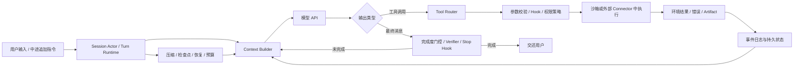
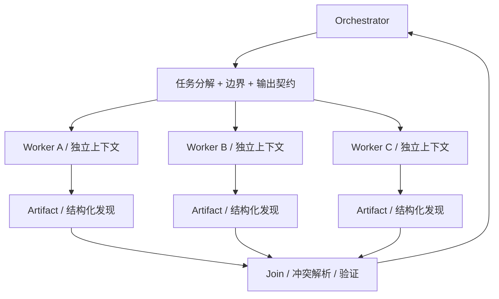

> 研究基线：2026-07-16（Asia/Shanghai）<br>
> Grok Build：`b189869b7755d2b482969acf6c92da3ecfeffd36`<br>
> Codex CLI：`800715d201651a2a07c2706dca10400109dae3d3`

这篇文章不是产品功能罗列，而是试图回答一个更根本的问题：**Agent 到底是什么，它为什么能工作，为什么经常失败，以及怎样把它做成可靠的软件系统。**

文中区分三种证据：

- **源码事实**：可以定位到固定提交中的实现。
- **厂商经验**：来自 OpenAI、Anthropic、xAI 的一手工程文章，但其数字通常来自厂商自己的系统和评测，不应无条件外推。
- **工程推论**：根据源码和一手实践抽象出的通用结论，会明确标为“推论”。

---

## 0. 先给结论：Agent 不是一个模型，而是一台以模型为策略内核的状态机

最有用的定义是：

> **Agent 是一个让模型在受控环境中反复观察、选择动作、执行动作、接收反馈，直到完成条件或停止条件成立的运行系统。**

可以把它写成：

\[
Agent = (Model, Context, Tools, Environment, Harness, Policy, Memory, Evaluator)
\]

其中：

- `Model`：根据当前上下文选择下一步，是概率性的策略，而不是整个 Agent。
- `Context`：模型这一步真正看见的工作内存，包括指令、历史、工具定义、环境状态、检索结果和压缩摘要。
- `Tools`：模型能够提出的结构化动作。
- `Environment`：文件系统、Shell、浏览器、数据库、SaaS、代码仓库等真实世界状态。
- `Harness`：循环、事件流、重试、并发、取消、压缩、恢复、调度等确定性运行时。
- `Policy`：沙箱、审批、身份、凭据、网络和工具权限。
- `Memory`：跨步、跨上下文窗口、跨会话保留状态的机制。
- `Evaluator`：判断结果是否真的完成、是否安全、质量是否达标。

OpenAI 对 Codex 的解释也从这个最小循环出发：模型要么输出最终消息，要么请求工具；工具结果追加回上下文，再次采样。并且软件 Agent 的主要输出常常不是最后一句话，而是被修改的环境状态，例如代码和文件。[OpenAI：Unrolling the Codex agent loop](https://openai.com/index/unrolling-the-codex-agent-loop/)

这带来第一条最重要的认知：

> **模型说“完成了”只是一个候选终止信号；环境是否达到目标才是任务结果。**

Anthropic 在 Agent 评测中同样区分 transcript 与 outcome：订票 Agent 声称“已经订好”不算成功，数据库中存在正确预订才算成功。[Anthropic：Demystifying evals for AI agents](https://www.anthropic.com/engineering/demystifying-evals-for-ai-agents)

---

## 1. 一次 Agent 运行到底发生了什么

设时刻 `t` 的系统状态为：

```text
s_t = {
  goal, conversation_history, environment_snapshot,
  permissions, budget, pending_user_events,
  active_tools, durable_artifacts, retry_state
}
```

Harness 每一轮做四件事：

```text
c_t = build_context(s_t)
y_t ~ model.sample(c_t, tool_specs(s_t))
event_t = interpret(y_t)
s_{t+1} = reduce(s_t, event_t, environment_result)
```

完整工程流程通常是：



真正成熟的 Agent 循环与教程里的十几行 `while` 有六个关键差别：

1. **模型输入是动态装配的**，不是固定 system prompt。
2. **模型输出先成为提案**，经过解析、策略、权限和运行时后才成为动作。
3. **工具失败通常要返回给模型成为观察**，而不是直接让进程崩溃。
4. **用户可以在运行中 steering / interject**，所以下一轮状态还包含异步事件。
5. **“没有工具调用”不一定等于结束**，还可能被完成度门控重新打开。
6. **上下文会耗尽**，需要压缩、外部 Artifact 和跨会话恢复。

---

## 2. Agent、Workflow、RAG、聊天机器人并不是一回事

Anthropic 给出了很有用的边界：**Workflow 的路径由代码预先定义；Agent 让模型动态决定流程和工具使用。** 最简单可行方案应优先，Agent 用更高延迟和成本换取在开放问题上的适应性。[Anthropic：Building Effective AI Agents](https://www.anthropic.com/engineering/building-effective-agents)

| 形态 | 谁决定步骤 | 是否改变环境 | 适合场景 | 核心风险 |
|---|---|---:|---|---|
| 单次 LLM 调用 | 开发者 | 通常否 | 总结、分类、生成 | 幻觉、格式不稳 |
| RAG 应用 | 检索逻辑 + 模型 | 通常否 | 基于资料回答 | 检索缺失、引用错配 |
| 固定 Workflow | 代码 / DAG | 可以 | 路径稳定、合规流程 | 分支爆炸、适应性弱 |
| 单 Agent | 模型动态选择 | 可以 | 步骤未知、需反复试验 | 循环、误操作、提前结束 |
| 长程 Agent | 模型 + 持久 Harness | 可以 | 跨多个上下文窗口和会话 | 状态漂移、恢复、成本 |
| Multi-Agent | Orchestrator + Workers | 可以 | 可独立并行的广度工作 | 协调、冲突、Token 膨胀 |

Anthropic 总结的 prompt chaining、routing、parallelization、orchestrator-workers、evaluator-optimizer，本质上是可组合的控制流模式。它们不必都做成自治 Agent；固定路径清楚时，直接写成 Workflow 通常更便宜、更可测。[Anthropic：Building Effective AI Agents](https://www.anthropic.com/engineering/building-effective-agents)

“是不是 Agent”也不是二元问题，更适合沿五个轴判断自治程度：

- **决策自由度**：步骤固定，还是模型可改变计划？
- **动作权限**：只能读，还是能写文件、发消息、部署、转账？
- **时间跨度**：一次请求、数小时、跨天，还是持续监控？
- **状态持久度**：仅上下文，还是跨会话记忆和外部 Artifact？
- **并发广度**：单循环，还是多个子 Agent / 后台任务？

Multi-Agent 只是最后一个轴上的扩展，不等于“更 Agent”。

---

## 3. 两套源码如何落地这个抽象

### 3.1 Codex CLI：以 Session / Turn 为中心的可组合执行内核

Codex 的主实现位于 Rust 工作区 `codex-rs`。主循环的核心是 [`run_turn`](https://github.com/openai/codex/blob/800715d201651a2a07c2706dca10400109dae3d3/codex-rs/core/src/session/turn.rs#L144-L255)：

1. 采样前检查是否需要压缩。
2. 捕获这一步的环境和 TurnContext。
3. 装配 Skills、Plugins、Connectors、Hooks 和用户输入。
4. 循环构建模型请求、消费 Responses 事件流。
5. 把模型的工具调用交给工具运行时。
6. 把工具结果记录进历史；若仍需 follow-up，继续采样。
7. 处理用户中途输入、stop hook、上下文溢出和取消。

每一步都会重新调用 [`built_tools`](https://github.com/openai/codex/blob/800715d201651a2a07c2706dca10400109dae3d3/codex-rs/core/src/session/turn.rs#L1130-L1225) 构造 `ToolRouter`，说明工具集合是**当前 Step 的能力快照**，不是进程启动时永不变化的常量。Router 同时保存模型可见的工具规范和实际处理器。[`ToolRouter` 源码](https://github.com/openai/codex/blob/800715d201651a2a07c2706dca10400109dae3d3/codex-rs/core/src/tools/router.rs#L35-L115)

Codex 的工具并发设计很值得学习：

- 模型标记可并行的工具取得读锁，可同时执行。
- 不支持并行的工具取得写锁，和其他工具互斥。
- 非致命工具错误被包装成工具输出重新交给模型；只有 `Fatal` 上升为 Turn 错误。
- 取消时区分工具是否已经产生终态，避免重复写入终止结果。

实现见 [`ToolCallRuntime`](https://github.com/openai/codex/blob/800715d201651a2a07c2706dca10400109dae3d3/codex-rs/core/src/tools/parallel.rs#L80-L175)。流式采样侧使用 `FuturesOrdered` 收集工具 Future，意味着**执行可以并行，但写回模型历史保持稳定顺序**。[流式循环源码](https://github.com/openai/codex/blob/800715d201651a2a07c2706dca10400109dae3d3/codex-rs/core/src/session/turn.rs#L1955-L2055)

Multi-Agent 不是简单地再开几个 API 请求。Codex 使用根任务范围的 [`AgentControl`](https://github.com/openai/codex/blob/800715d201651a2a07c2706dca10400109dae3d3/codex-rs/core/src/agent/control.rs#L90-L160) 管理线程树、消息、运行容量和 rollout budget；子 Agent 共享同一个根级控制面，并继承运行时权限。当前官方手册也强调：子 Agent 消耗更多 Token，读重型独立任务更合适，并行写代码更容易产生冲突。[Codex Subagents 文档](https://learn.chatgpt.com/docs/agent-configuration/subagents)

### 3.2 Grok Build：以 Actor 为中心、功能更外扩的长程 Agent 运行时

Grok Build 的仓库把界面、Agent Runtime、工具和宿主工作区明确拆开：TUI 在 `xai-grok-pager`，核心运行时在 `xai-grok-shell`，工具在 `xai-grok-tools`，文件系统 / VCS / checkpoint 在 `xai-grok-workspace`。[Grok Build README](https://github.com/xai-org/grok-build/tree/b189869b7755d2b482969acf6c92da3ecfeffd36)

核心循环位于 [`process_conversation_turn`](https://github.com/xai-org/grok-build/blob/b189869b7755d2b482969acf6c92da3ecfeffd36/crates/codegen/xai-grok-shell/src/session/acp_session_impl/turn.rs#L1693-L2180)。它在循环中处理：

- 用户 interjection、skills reminder、monitor 事件和 memory reminder；
- 自动压缩与可选的 two-pass 预压缩；
- 动态工具规范和结构化输出工具；
- 采样、认证刷新、重试、Token / telemetry 记录；
- 工具执行、权限、hooks、用户 follow-up、最大轮数；
- 结束前的 TodoGate。

TodoGate 是很有代表性的“Harness 智能”：当模型不再调用工具、准备结束，但 Todo 仍有未完成项时，运行时会注入提醒并继续循环；同时设置最大触发次数，防止无限续命。[TodoGate 源码](https://github.com/xai-org/grok-build/blob/b189869b7755d2b482969acf6c92da3ecfeffd36/crates/codegen/xai-grok-shell/src/session/acp_session_impl/turn.rs#L2100-L2165)

Grok 的工具执行也先做解析、Hook 和权限 preflight；批准的调用通过 `FuturesUnordered` 并发执行，并对冲突文件加资源锁，等待型工具还能被用户 interjection 打断。[工具调度源码](https://github.com/xai-org/grok-build/blob/b189869b7755d2b482969acf6c92da3ecfeffd36/crates/codegen/xai-grok-shell/src/session/acp_session_impl/tool_calls.rs#L430-L545)

它的压缩策略是显式配置对象：默认在上下文使用 85% 时触发，可选独立 compact model、压缩前 memory flush、300 秒墙钟预算，以及后台预生成前缀摘要的 two-pass 模式。[`CompactionPolicy`](https://github.com/xai-org/grok-build/blob/b189869b7755d2b482969acf6c92da3ecfeffd36/crates/codegen/xai-grok-agent/src/compaction.rs#L1-L55)

Grok 的子 Agent 控制面支持：

- `New`、`Forked`、`Resumed` 三种上下文来源；
- 前台 / 后台运行；
- 独立 worktree；
- 共享终端、环境、调度器和父级变更追踪；
- 旧上下文摘要 + 最近轮次原样保留的 fork 压缩。

参见 [`SubagentCoordinator`](https://github.com/xai-org/grok-build/blob/b189869b7755d2b482969acf6c92da3ecfeffd36/crates/codegen/xai-grok-shell/src/agent/subagent/mod.rs#L1-L100) 及其[状态结构](https://github.com/xai-org/grok-build/blob/b189869b7755d2b482969acf6c92da3ecfeffd36/crates/codegen/xai-grok-shell/src/agent/subagent/mod.rs#L549-L800)。

更特别的是 Goal 子系统：Agent 调用 `update_goal` 请求完成后，Harness 可以启动 skeptic 子 Agent 组成的 verifier panel，将结果分为 `Achieved`、`NotAchieved` 或 `Blocked`；重复缺口会触发 stall / no-progress 暂停，strategist 可以介入，达到验证次数上限也会 backoff。[Goal 状态处理](https://github.com/xai-org/grok-build/blob/b189869b7755d2b482969acf6c92da3ecfeffd36/crates/codegen/xai-grok-shell/src/session/acp_session_impl/goal.rs#L648-L830)、[skeptic 验证阶段](https://github.com/xai-org/grok-build/blob/b189869b7755d2b482969acf6c92da3ecfeffd36/crates/codegen/xai-grok-shell/src/session/acp_session_impl/goal.rs#L1070-L1300)

一个很细但重要的设计取舍：源码里存在 `FailOpenAchieved`，即某些验证基础设施错误会按“已完成”放行，以免系统永久卡住。这是可用性与假阳性之间的明确权衡；高风险领域通常应该按动作风险选择 fail-open、fail-closed 或转人工，而不是全局统一。

Grok 的采样层能够适配 Chat Completions、OpenAI Responses 和 Anthropic Messages 三种 API。[Sampler backend 分派](https://github.com/xai-org/grok-build/blob/b189869b7755d2b482969acf6c92da3ecfeffd36/crates/codegen/xai-grok-sampler/src/client.rs#L1825-L2000) 这说明 Harness 可以跨模型供应商复用，但也意味着它必须统一不同的流式事件、工具语义、推理内容、压缩和错误模型。

最后，Grok 的第三方声明明确指出，`apply_patch`、文件搜索 / 列表 / 读取等工具实现来自 Codex，另一些工具来自 OpenCode。[第三方声明](https://github.com/xai-org/grok-build/blob/b189869b7755d2b482969acf6c92da3ecfeffd36/crates/codegen/xai-grok-tools/THIRD_PARTY_NOTICES.md) 这揭示了一个领域趋势：**上层 Agent 编排可以差异很大，底层确定性工具原语正在收敛和复用。**

### 3.3 对照表：相同骨架，不同工程重心

| 维度 | Codex CLI | Grok Build | 通用教训 |
|---|---|---|---|
| 核心抽象 | Session → Turn → Step | Session Actor → Conversation Turn | Agent 是有状态事件循环 |
| 模型接口 | Responses-first | Chat Completions / Responses / Messages | 抽象层要隔离供应商语义 |
| 工具集合 | 每 Step 动态构造 Router | 每 Turn 准备并动态扩展 | 工具列表是上下文的一部分 |
| 并发 | 并行执行 + 有序写回；读写闸门 | 完成顺序消费 + 资源冲突锁 | 并发必须定义可见顺序和冲突语义 |
| 用户 Steering | pending input 在循环边界注入 | interjection 可打断等待工具 | Agent 必须支持运行中改变意图 |
| 完成门控 | assistant final + stop hook / pending input | TodoGate + structured output + interjection | “模型停了”不能直接等同“任务完成” |
| 上下文 | 完整历史、前缀缓存、远程 / 本地压缩 | 阈值压缩、memory flush、two-pass | 压缩是有损状态迁移 |
| 长程运行 | rollout budget、恢复、plans / artifacts | Goal、verifier、stall、doom-loop recovery、scheduler | 长程能力主要来自 Harness，而非更长 prompt |
| Multi-Agent | 根级线程树控制面、继承权限和预算 | fork / resume / background / worktree / skeptic roles | 上下文隔离、生命周期和权限比 spawn 更难 |
| 安全 | OS 沙箱、审批、工具注解、自动 review | workspace 权限、hooks、sandbox、工具 preflight | 模型只能提议，确定性策略决定是否执行 |

我的判断不是谁“更强”，而是：

- **Codex 更像一个边界清晰、可组合、可审计的 Agent 执行内核。**
- **Grok Build 更像在通用执行内核上继续扩展目标管理、完成验证、恢复和后台调度的长程运行时。**

二者共同证明：产品差异越来越多地发生在 Harness，而不只在模型。

---

## 4. Context Engineering：Agent 的真正“工作内存”

Anthropic 把 context engineering 定义为：持续选择和维护每次推理最有用的一组 Token，包括指令、工具、历史和外部数据；上下文越长并不自动越好，注意力会出现边际递减和 context rot。[Anthropic：Effective context engineering for AI agents](https://www.anthropic.com/engineering/effective-context-engineering-for-ai-agents)

### 4.1 上下文不是聊天记录的同义词

一次采样的上下文通常包含：

```text
1. 模型基础指令
2. 产品 / 开发者策略
3. 沙箱与审批说明
4. 仓库级 AGENTS.md / CLAUDE.md
5. 当前 Skill / Plugin / MCP 工具定义
6. 环境快照：cwd、shell、git 状态、时间等
7. 历史消息、推理摘要、工具调用与工具结果
8. 当前用户输入和运行中追加指令
9. 压缩摘要、记忆提醒、计划、Todo、预算提醒
```

OpenAI 的 Codex 文章展示了这套分层，并说明 Codex 把历史作为完整 input 再发给 Responses API，以支持无状态和 ZDR；为了利用 prompt cache，旧 prompt 要成为新 prompt 的精确前缀，静态项必须稳定地放在前面。[OpenAI：Unrolling the Codex agent loop](https://openai.com/index/unrolling-the-codex-agent-loop/)

这意味着一个看似无害的运行时操作——例如重写早先的环境说明、改变工具顺序、修改历史项——都可能同时造成两类问题：

1. 语义问题：模型误以为过去发生了变化。
2. 性能问题：精确前缀改变，prompt cache miss。

所以优秀 Harness 倾向于**追加状态变化，而不是篡改历史**。

### 4.2 五种“记忆”必须分开

| 类型 | 载体 | 生命周期 | 优点 | 主要缺陷 |
|---|---|---|---|---|
| 即时工作记忆 | 当前 context | 单次采样 | 信息最完整 | 昂贵、会腐烂、会溢出 |
| 对话历史 | 消息 / tool events | 单会话 | 可回放 | 线性膨胀、噪声多 |
| 压缩记忆 | summary / opaque compact item | 多个窗口 | 腾出空间 | 有损、可能丢约束和因果 |
| Durable memory | 用户偏好、事实库、向量 / 结构化存储 | 跨会话 | 可复用 | 过时、污染、权限与隐私 |
| Artifact memory | 计划、Todo、progress、git、测试结果、数据库状态 | 跨会话 / 跨 Agent | 可验证、可由工具按需读取 | 需要结构和维护纪律 |

对长程任务，最可靠的常常是最后一种。Anthropic 的实验发现 compaction 不足以支撑长程编码；更有效的做法是 initializer + 增量 coding agent，把功能清单、progress 文件、git 提交和可运行测试留在环境里。[Anthropic：Effective harnesses for long-running agents](https://www.anthropic.com/engineering/effective-harnesses-for-long-running-agents)

OpenAI 在 agent-first 仓库中的做法也类似：短 `AGENTS.md` 只做目录，把 `docs/` 作为系统记录，计划和决策日志版本化，并用 CI 检查结构与新鲜度。[OpenAI：Harness engineering](https://openai.com/index/harness-engineering/)

因此：

> **长上下文是更大的桌面；Artifact 是文件柜；检索是索引；压缩是会议纪要。四者不能互相替代。**

### 4.3 Progressive disclosure

把数百个工具定义、全部文档和所有历史一次塞入模型，是 Agent 系统最常见的反模式。更好的结构是：

- 先加载短地图和名称；
- 让模型搜索工具 / 文档；
- 只展开当前需要的规范；
- 大数据先在执行环境中过滤，再把高信号结果交给模型。

Anthropic 的 MCP code-execution 示例中，按需从文件系统发现工具，把一个场景的工具定义消耗从 150,000 Token 降到 2,000 Token；这是特定示例，不是所有系统的保证，但它很好地说明了量级。[Anthropic：Code execution with MCP](https://www.anthropic.com/engineering/code-execution-with-mcp)

---

## 5. Tool Engineering：工具不是普通 API，而是给概率程序使用的 UI

传统 API 的调用者通常是确定性代码；Agent Tool 的调用者会误解名字、漏参数、选择错误工具、用错误顺序组合。因此工具规范同时是：

- API schema；
- 模型提示的一部分；
- 能力和权限的声明；
- 错误恢复协议；
- 上下文预算消费者。

Anthropic 把 Tool 描述为确定性系统和非确定性 Agent 之间的契约，并强调少而清晰的高价值工具、命名空间、高信号输出、Token 效率和基于真实多步任务的评测。[Anthropic：Writing effective tools for agents](https://www.anthropic.com/engineering/writing-tools-for-agents)

### 5.1 好工具的十条标准

1. **名称唯一且表达意图**：`search_logs` 优于模糊的 `query`。
2. **职责能被区分**：避免五个功能高度重叠的 search 工具。
3. **Schema 严格、参数语义明确**：`user_id` 优于 `user`。
4. **默认输出短而高信号**：过滤、分页、范围和 `concise/detailed`。
5. **错误可操作**：告诉模型哪个字段错、允许什么值、怎样重试。
6. **副作用透明**：read-only、write、destructive、open-world 都应可机器识别。
7. **支持取消、超时和预算**：长等待不能占死整个 Agent。
8. **能处理重放**：写操作应带 idempotency key 或显式去重语义。
9. **结果引用 Artifact**：大输出写文件 / 对象存储，模型只收摘要和句柄。
10. **有 Agent-in-the-loop eval**：不能只测函数本身，要测模型能否正确发现和组合它。

### 5.2 工具结果应该是什么

理想结果不仅有 stdout，而是结构化状态：

```json
{
  "status": "success | error | partial | cancelled",
  "summary": "给模型看的短结论",
  "artifacts": [{"uri": "...", "media_type": "..."}],
  "changed_resources": ["src/app.rs"],
  "retryable": false,
  "next_action_hint": null,
  "telemetry": {"duration_ms": 83, "bytes": 1420}
}
```

这样 Harness 才能独立完成：重试、并发冲突检测、审计、结果截断和恢复。

### 5.3 MCP、模型 API、Agent Client Protocol 分别解决什么

这些层经常被混为一谈：

| 协议层 | 解决的问题 | 例子 |
|---|---|---|
| 模型推理 API | 怎样发上下文、工具规范并接收流式模型输出 | OpenAI Responses、Anthropic Messages |
| Tool / Context 协议 | 怎样发现并调用外部工具和数据源 | MCP |
| Agent ↔ 客户端协议 | IDE / TUI / 编排器怎样与完整 Agent 会话交互 | Grok 的 ACP、Codex app-server 类接口 |
| Agent 内部控制面 | 怎样 spawn、message、wait、resume、cancel 子 Agent | Codex `AgentControl`、Grok `SubagentCoordinator` |

MCP 让工具接入标准化，但不会自动提供完整 Agent，也不会自动解决权限。OpenAI 对 Codex 的说明明确指出：Codex 自己的 Shell 沙箱不自动包住第三方 MCP 工具，外部工具必须实现自己的 guardrails。[OpenAI：Unrolling the Codex agent loop](https://openai.com/index/unrolling-the-codex-agent-loop/)

---

## 6. Planning、Reflection、Verifier：它们不是魔法模块

### 6.1 Plan 是可见的控制 Artifact

Plan 的主要价值不是让模型突然获得更高智力，而是：

- 把目标分解显式化；
- 让人能在高成本动作前纠偏；
- 给长任务提供进度索引；
- 为下一会话或子 Agent 提供压缩后的意图；
- 让 Harness 检测“仍有步骤未完成”。

xAI 的发布页把 Plan Mode、逐步评论和批准作为 Grok Build 的主要交互方式；其 TodoGate 又把计划状态变成结束条件的一部分。[xAI：Introducing Grok Build](https://x.ai/news/grok-build-cli)

如果 Plan 只是一段自然语言，并且任务进展不会机械更新，它很快会变成过时叙事。更可靠的是结构化状态：`pending / in_progress / completed / blocked`，每次最多一个 `in_progress`，完成项必须有环境证据。

### 6.2 Reflection 是额外采样，不是可靠性证明

“让模型自我反思”有用，是因为它提供了第二次条件采样和不同注意焦点；但同一模型可能重复同一盲点。可靠性从弱到强大致是：

```text
同一次回答中的自检
< 独立第二次采样
< 不同角色 / 不同上下文的 reviewer
< 确定性测试和环境验证
< 多层 grader + 人工审计
```

### 6.3 Verifier 必须与任务的 Ground Truth 对接

好的完成门控会问：

- 文件、数据库或远程系统是否真的改变？
- 测试是否覆盖用户行为，而不只是单元细节？
- 约束是否全部满足？
- 是否有未处理副作用或安全违规？
- 当前结果是 `complete`、`partial`、`blocked` 还是 `failed`？

Grok 的 skeptic panel 是“LLM verifier”路线；Codex 的 stop hook、测试、review 和环境 diff 是“运行时 + 工程证据”路线。生产系统通常需要两者组合。

---

## 7. 长程 Agent：真正难的是跨上下文保持项目连续性

单个上下文窗口内的 Agent 主要解决“下一步做什么”。长程 Agent 还要解决：

- 上一次做到哪里；
- 哪些事实仍然有效；
- 环境是否处于可继续的干净状态；
- 哪些尝试失败过，为什么；
- 是否在重复同一种无效策略；
- 何时应该停下并请求人类决策。

### 7.1 长程可靠性的最小组合

1. **Durable event log**：用户、模型、工具、权限和状态转换可重放。
2. **Checkpoint**：在副作用后记录一致状态，崩溃后从最近安全点恢复。
3. **Progress Artifact**：目标、已完成、下一步、风险和验证证据。
4. **Versioned environment**：代码用 git，数据操作用事务 / 审计记录。
5. **Clean handoff**：每个上下文结束时，不留下半完成且无说明的状态。
6. **Loop detection**：重复工具参数、重复错误、无新 Artifact、相同 verifier 缺口。
7. **Budget**：Token、工具次数、墙钟、金钱、子 Agent 数和重试次数。
8. **Pause taxonomy**：等待外部事件、需要用户决策、预算耗尽、不可恢复错误要分开。

Anthropic 的长程实验强调“一次只做一个 feature、提交 git、更新 progress、端到端测试”；Grok 则把重复 NotAchieved、no-progress、Blocked 和 doom-loop 直接做进运行时。两者共同说明：

> **长程性不是让一个模型无限说下去，而是让许多有限上下文在可验证 Artifact 上接力。**

### 7.2 恢复比重试更重要

普通服务失败可以重放请求；Agent 的工具可能已经部分执行，盲目重试会重复发消息、重复付款或覆盖文件。因此每个副作用动作都需要回答：

- 操作是否幂等？
- 是否有外部 operation ID？
- 响应丢失时怎样查询真实结果？
- 事务边界在哪里？
- 恢复后模型看到的是“未执行”“已执行”还是“不确定”？

“不确定”必须是第一等状态，而不是伪装成 error 后直接重试。

---

## 8. Multi-Agent：它扩展的是并行搜索和上下文预算，不是自动产生集体智慧

Multi-Agent 的最实用模型是 orchestrator-workers：主 Agent 分解问题，子 Agent 在隔离上下文中工作，返回结构化结果或 Artifact，主 Agent 综合。

### 8.1 为什么有时有效

- 多条独立路径可并行，降低墙钟时间。
- 每个 Worker 有独立上下文，减少主线程的工具日志污染。
- 不同角色可以拥有不同工具、模型和安全权限。
- 多次独立尝试 / 投票降低单一路径偏差。
- 子 Agent 先压缩信息，主 Agent 只接收高信号结果。

Anthropic 在自己的广度研究评测中报告，Opus 4 主 Agent + Sonnet 4 子 Agent 相比单 Agent Opus 4 提升 90.2%；但同时，普通 Agent 约用聊天 4 倍 Token，Multi-Agent 约用聊天 15 倍 Token，而且紧密共享上下文、依赖很多的编码任务并不适合。这些是特定厂商系统数据，但很好地校正了“多 Agent 免费变强”的直觉。[Anthropic：How we built our multi-agent research system](https://www.anthropic.com/engineering/multi-agent-research-system)

### 8.2 什么时候不该用

- 子任务高度串行，B 必须知道 A 的每个细节。
- 多个 Agent 会同时修改同一文件或同一远程对象。
- 任务本身只需几次工具调用。
- 验证结果很难合并，主 Agent 无法判断冲突。
- 子 Agent 返回大段叙述，反而把主上下文塞满。

### 8.3 工程上真正困难的部分



成熟实现要处理：

- 任务边界和完成契约；
- 父历史是全量 fork、最近 N 轮，还是摘要；
- 权限继承和最小权限覆盖；
- 最大深度、并发数、Token 总预算；
- 工作区隔离、worktree 和合并冲突；
- background Agent 的唤醒、取消、失联和恢复；
- 子 Agent 输出的信任级别和 prompt injection 传播。

Codex 的根级 `AgentControl` 和 Grok 的 Fork / Resume / Worktree 状态机正是在解决这些问题，而不是简单的 `Promise.all(modelCall())`。

### 8.4 一条决策规则

可以用下面的近似判断：

```text
使用 Multi-Agent，当且仅当：
并行收益 + 上下文隔离收益 + 多样性收益
>
额外 Token + 协调延迟 + 合并风险 + 权限风险
```

默认先做好单 Agent；只有 eval 证明瓶颈来自可并行广度或上下文污染时，再增加子 Agent。

---

## 9. Safety：安全不是“模型听话”，而是限制它即使不听话也做不了什么

Agent 风险可以先用 Anthropic 的表达拆成：

```text
Risk = failure likelihood × blast radius
```

模型训练、系统提示和分类器主要降低前者；沙箱、权限、凭据隔离和网络策略限制后者。[Anthropic：How we contain Claude across products](https://www.anthropic.com/engineering/how-we-contain-claude)

工程上还可以进一步把 blast radius 拆成以下乘积——这是本文的推论：

```text
Blast radius ≈ 可触达资源 × 权限强度 × 凭据寿命 × 持续时间 × 并发广度
```

### 9.1 必须分层的控制

| 层 | 控制 | 解决什么 |
|---|---|---|
| 模型层 | 训练、system prompt、分类器、reviewer | 降低错误提案概率 |
| Tool 层 | 严格 schema、read/write/destructive 注解、allowlist | 缩小可表达动作 |
| Policy 层 | 审批、规则、用户授权范围 | 决定哪些提案可执行 |
| Runtime 层 | OS sandbox、VM、容器、进程限制 | 强制文件和进程边界 |
| Network 层 | 默认拒绝、域名 allowlist、egress proxy | 防外泄和下载恶意载荷 |
| Identity 层 | 短期 scoped token、Agent 独立 principal、keychain | 限制凭据滥用 |
| State 层 | checkpoint、事务、备份、不可变审计 | 限制和恢复副作用 |
| Observability | trace、审批原因、资源变化、异常模式 | 发现和追责 |

Anthropic 强调有效沙箱需要**文件系统和网络隔离同时存在**：只有文件隔离时仍可能经网络外泄，只有网络隔离时可能读取敏感文件或绕路获得网络。其内部数据称沙箱把权限提示减少了 84%，说明好的硬边界不仅更安全，也减少 approval fatigue。[Anthropic：Claude Code sandboxing](https://www.anthropic.com/engineering/claude-code-sandboxing)

OpenAI 的 Codex 安全实践也采用相同分层：OS 沙箱是硬边界，审批决定是否跨界，网络使用受管策略，凭据放入安全 keyring，跨界动作可由独立 auto-review Agent 审核。[OpenAI：Running Codex safely](https://openai.com/index/running-codex-safely/)

### 9.2 Prompt injection 为什么是 Agent 特有的高风险

普通聊天中的注入主要污染答案；有工具权限的 Agent 中，恶意 README、网页、邮件或 MCP 返回可以影响动作。即使 Connector 本身经过审计，Connector 读到的数据仍可能带恶意指令。

因此所有外部内容都应带 trust label：

```text
developer policy > explicit user intent > trusted internal state
> verified tool metadata > untrusted external content
```

但 trust label 只是模型提示，不能取代强制策略。高价值动作仍要通过目的地、资源、参数和授权范围的确定性校验。Anthropic 还特别指出 persistent memory poisoning 和 Multi-Agent trust escalation：恶意内容一旦写入长期记忆或被子 Agent“洗成”高信任摘要，会跨会话持续影响系统。[Anthropic：How we contain Claude across products](https://www.anthropic.com/engineering/how-we-contain-claude)

### 9.3 Approval 不是沙箱

- **沙箱**回答：技术上最多能做到什么？
- **审批**回答：何时需要停下来请求更高权限？
- **授权**回答：用户真实允许的目的和范围是什么？

让用户不断点“允许”不是强安全。审批太频繁会形成习惯性通过；真正的方向是让大多数低风险动作在窄沙箱内自动完成，只在边界处请求狭窄、可理解、可审计的授权。

---

## 10. Evals 与 Observability：评测的是模型 + Harness + 工具 + 环境

Anthropic 对术语的拆分非常实用：task 是测试问题，trial 是一次随机运行，grader 是评分逻辑，transcript 是完整轨迹，outcome 是环境终态，agent harness 是模型采取动作的脚手架。因为输出非确定，同一 task 必须跑多个 trials。[Anthropic：Demystifying evals for AI agents](https://www.anthropic.com/engineering/demystifying-evals-for-ai-agents)

### 10.1 三层评测

1. **Outcome eval**：任务终态对不对，是第一优先级。
2. **Trajectory eval**：工具选择、步骤、错误恢复是否合理，用来诊断。
3. **Operational eval**：成本、延迟、权限、失败恢复和用户干预是否可接受。

推荐指标：

| 类别 | 指标 |
|---|---|
| 结果 | task success、约束满足、最终环境 diff、回归率 |
| 可靠性 | 多 trial 成功率、最差分位、连续成功 `pass^k` |
| 效率 | 输入 / 输出 Token、模型轮数、工具次数、墙钟、缓存命中 |
| 工具 | 参数错误、重试、超时、无效 / 重复调用、截断率 |
| 自治 | 人工干预次数、澄清质量、approval 次数、blocked 识别 |
| 安全 | 越权提案、沙箱阻断、注入成功率、敏感数据触达 |
| 恢复 | checkpoint 恢复率、重复副作用、平均恢复时间 |
| Multi-Agent | 分工重叠、合并冲突、Worker 利用率、额外 Token / 收益 |

`pass@k` 和 `pass^k` 应区分：

- `pass@k`：k 次里至少一次成功，适合允许重试 / 选优的场景。
- `pass^k`：连续 k 次都成功，更接近用户期待的稳定可靠性。

### 10.2 Grader 的优先级

```text
确定性环境断言
> 数据库 / API / 文件终态检查
> 测试、静态分析、规则
> 独立 LLM Judge + rubric
> 对关键样本的人工复核
```

不要把“期待的工具轨迹”写得过死，因为正确路径可能不止一种；除非你的目标就是验证安全流程或强制步骤。

### 10.3 从多少测试开始

Anthropic 建议早期从 20–50 个真实失败和手工检查转化的任务开始；系统成熟、效果差异变小时再扩大样本。[Anthropic：Demystifying evals for AI agents](https://www.anthropic.com/engineering/demystifying-evals-for-ai-agents)

最好的回归集来源不是凭空编题，而是：

- 用户投诉和人工接管；
- 真实的提前结束；
- 工具参数错误；
- context compaction 后丢失约束；
- 权限误判；
- 重复副作用；
- 子 Agent 冲突；
- 供应商 API 行为变化。

### 10.4 Trace 要记录因果，而不只是日志

至少需要可关联的：

```text
thread_id / turn_id / step_id / model_request_id / tool_call_id
context version / tool registry version / policy decision
token & cache usage / timing / retries / cancellation
environment diff / artifact references / completion verdict
```

生产调试常见问题不是“最终答案错了”，而是：模型选错工具、工具描述误导、结果被截断、权限拒绝没被正确解释、压缩丢了约束、子 Agent 重复搜索。没有完整轨迹就无法区分这些根因。Anthropic 的 Multi-Agent 团队也强调，非确定系统需要 production tracing 和 checkpoint / resume，而不是只靠重现同一 prompt。[Anthropic：Multi-Agent research system](https://www.anthropic.com/engineering/multi-agent-research-system)

---

## 11. 常见失败模式，以及应该修模型还是修 Harness

| 症状 | 常见根因 | 优先修复 |
|---|---|---|
| 声称完成但功能不工作 | 把 assistant final 当 outcome | 终态 grader、E2E 工具、完成门控 |
| 做一半就停 | 目标没有结构化状态 | Todo / plan gate、进度 Artifact |
| 反复调用同一工具 | 错误不可操作、无 loop detector | 改错误契约、检测重复参数 / 无新状态 |
| 上下文越长越笨 | 噪声、工具结果过大、约束埋没 | progressive disclosure、过滤、压缩、Artifact |
| 压缩后忘记关键约束 | 摘要有损，没有外部真相 | 把约束版本化到文件 / DB，压缩后重新注入 |
| 工具选错 | 名称重叠、描述含糊、工具太多 | 精简、namespace、tool-search、Agent eval |
| 并发写冲突 | 错把可并行推理当可并行副作用 | 资源锁、worktree、串行提交、冲突检测 |
| 失败后重复发消息 / 扣款 | 无幂等键，响应状态不确定 | operation ID、查询终态、事务和恢复状态机 |
| 多 Agent 重复劳动 | 分工目标太模糊 | 明确边界、输出契约、来源 / 文件所有权 |
| 多 Agent 汇总失真 | 只传自然语言摘要 | 共享 Artifact、直接引用证据、主 Agent 验证 |
| 审批很多但仍不安全 | approval fatigue、无硬边界 | 文件 + 网络沙箱、窄权限、自动低风险 review |
| Prompt injection 导致动作 | 外部内容与指令混在同一信任层 | trust labeling、tool proxy、egress 和资源策略 |
| 升级模型后行为突变 | Harness 对隐含模型习惯过拟合 | 供应商适配层、回归 eval、版本化 prompt / tools |

一个很实用的诊断顺序：

```text
1. 环境和工具是否让正确动作成为可能？
2. 模型是否看到了必要且不过量的上下文？
3. 工具名称、schema、结果和错误是否可理解？
4. Harness 是否正确处理并发、重试、取消和终止？
5. 完成条件是否能机械验证？
6. 最后才问：是否需要更强模型或更高 reasoning effort？
```

OpenAI 的 agent-first 工程案例也总结过类似经验：失败时通常不是“再努力一点”，而是环境缺少可见、可执行、可强制的能力。[OpenAI：Harness engineering](https://openai.com/index/harness-engineering/)

---

## 12. 成本与性能：Agent 的昂贵来自串行模型轮数

粗略成本可以写成：

```text
总成本 = 模型输入 + 模型输出 + 工具计算 + 外部 API
       + 重试 + 压缩 + Reviewer + 子 Agent + 人工中断
```

延迟则近似：

```text
关键路径延迟 = 串行模型轮次之和
             + 每轮最慢的必要工具 / 并行分支
             + 审批 / 人工等待
```

所以优化优先级通常是：

1. 减少无效模型轮次和错误工具调用。
2. 稳定 prompt 前缀，提高缓存命中。
3. 压缩工具定义和工具结果。
4. 把确定性数据处理放到代码执行环境。
5. 只并行真正独立的工具和子任务。
6. 按任务难度路由模型与 reasoning effort。
7. 给简单问题设置更小预算和更早停止条件。

Anthropic 对其研究系统的分析中，Token 使用本身解释了 BrowseComp 表现差异的 80%，模型选择和工具调用数再解释大部分剩余差异；这说明扩展计算确实能换取表现，但也说明“更好”往往只是“花了更多推理和搜索预算”，必须和任务价值一起评估。[Anthropic：Multi-Agent research system](https://www.anthropic.com/engineering/multi-agent-research-system)

---

## 13. 如果你自己构建 Agent，正确的演进顺序

不要一开始就上 Multi-Agent、向量记忆、复杂图编排和几十个 MCP。一个可学习、可验证的顺序是：

### 阶段 1：最小闭环

只实现：

- 一个模型 API；
- `read_file`、`search`、`apply_patch`、`shell`、`finish` 五个工具；
- append-only event log；
- 最大轮数和取消；
- 最终 diff + 测试结果。

核心伪代码：

```python
while budget.remaining():
    state = store.load(thread_id)
    context = context_builder.build(state)
    response = model.sample(context, tools=registry.visible(state))
    store.append(response)

    if response.tool_calls:
        calls = parser.validate(response.tool_calls)
        decisions = policy.authorize(calls, state.user_grant)
        results = executor.run(
            decisions.allowed,
            sandbox=state.sandbox,
            idempotency_scope=state.turn_id,
            cancellation=state.cancel_token,
        )
        store.append(results)
        continue

    verdict = completion_gate.check(response, environment.snapshot())
    if verdict.done:
        return response.final_message
    store.append(verdict.continuation_hint)
```

### 阶段 2：让它可靠

- 非致命工具错误返回模型；
- 工具超时、取消、重试和幂等；
- 读工具并行、写工具互斥；
- 结构化 completion gate；
- 20–50 个真实任务，多 trial eval；
- outcome、Token、工具次数、延迟和权限指标。

### 阶段 3：让它长程

- 上下文预算和 compaction；
- 计划 / Todo / progress Artifact；
- checkpoint / resume；
- no-progress 和 doom-loop 检测；
- clean handoff；
- 等待外部事件与 blocked 状态。

### 阶段 4：让它安全地拥有更多能力

- OS 级文件沙箱；
- 网络 allowlist / proxy；
- 工具副作用注解；
- scoped credentials；
- 精确审批和独立 reviewer；
- 外部内容的 prompt-injection 防御；
- 审计和回滚。

### 阶段 5：最后才是 Multi-Agent

先用 eval 证明单 Agent 的瓶颈来自：

- 可并行的独立广度；
- 主上下文污染；
- 需要多样化独立尝试；
- 需要不同工具 / 权限角色。

然后增加：max depth、max concurrency、rollout budget、结构化 handoff、worktree / 资源所有权和 join verifier。

---

## 14. 一条真正能“透彻理解 Agent”的学习路线

### 第一层：亲手复现循环

目标：不依赖框架写出 100–300 行最小 Agent，理解 tool call、history、termination。
阅读：OpenAI 的 Agent loop 文章；Codex `run_turn` 的前 200 行。

练习：故意让工具返回错误、超时和超长输出，看模型如何恢复。

### 第二层：读工具运行时

目标：理解工具规范、动态注册、并发、有序写回、取消和 error-as-observation。
阅读：Codex `tools/router.rs`、`tools/parallel.rs`；Grok `tool_calls.rs`；Anthropic Tool Engineering。

练习：设计两个可并行 read 工具和一个必须串行 write 工具，验证没有竞态。

### 第三层：读 Context 与 Compaction

目标：区分 history、memory、summary、Artifact 和 retrieval。
阅读：Codex Agent loop 的缓存 / compact 部分；Grok `CompactionPolicy`；Anthropic Context Engineering。

练习：运行跨两个上下文窗口的任务，比较“只压缩”与“progress + git + feature list”。

### 第四层：读完成与长程状态

目标：理解 premature completion、TodoGate、verifier、blocked、stall 和恢复。
阅读：Grok `goal.rs`、TodoGate；Anthropic Long-running Harness。

练习：让 Agent 在“测试未通过但代码已写完”时尝试结束，完成门控必须拒绝。

### 第五层：读安全边界

目标：区分 model policy、approval、sandbox、authorization 和 containment。
阅读：OpenAI Running Codex Safely；Anthropic Sandboxing 与 Containment。

练习：用恶意 README 诱导读取 workspace 外文件，确认模型即使被说服也无法越界。

### 第六层：读 Evals

目标：把“感觉更聪明”变成 outcome、轨迹、成本和安全的回归数据。
阅读：Anthropic Demystifying Evals。

练习：为 20 个真实任务各跑 5 个 trial，观察平均成功率之外的长尾和重复失败簇。

### 第七层：读 Multi-Agent 控制面

目标：理解并行收益、上下文隔离、任务边界、预算、worktree 和合并。
阅读：Codex `AgentControl`、Grok `SubagentCoordinator`、Anthropic Multi-Agent Research。

练习：同一研究任务比较 single agent、固定并行 workflow、动态 orchestrator-workers 的质量 / Token / 墙钟。

---

## 15. 你最终应该牢牢记住的十二条规律

1. **Agent 的真实输出是环境终态，不是最后一句话。**
2. **模型是概率策略；Harness 才负责状态、权限、恢复和终止。**
3. **Context 是有限工作内存，不是无限数据库；越长不必然越聪明。**
4. **Compaction 是有损迁移，不能替代 Durable Artifact。**
5. **工具是给概率调用者使用的 UI，描述和结果格式会直接改变能力。**
6. **错误应该尽量成为可操作的观察，但副作用错误不能盲目重试。**
7. **Plan 的价值是可见、可更新、可验证；不是一段漂亮的预言。**
8. **模型停止不等于目标完成，必须有独立 completion gate。**
9. **并行的前提是资源独立；并行推理不等于并行写入安全。**
10. **Multi-Agent 主要扩展 Token、上下文和并行广度，同时放大成本和协调风险。**
11. **提示和分类器降低犯错概率；沙箱和最小权限限制犯错后果。**
12. **没有 eval 和 trace 的 Agent 只是一次性 Demo，无法成为可演进系统。**

---

## 16. 主要一手资料索引

### 源码

- [xai-org/grok-build 固定提交](https://github.com/xai-org/grok-build/tree/b189869b7755d2b482969acf6c92da3ecfeffd36)
- [openai/codex 固定提交](https://github.com/openai/codex/tree/800715d201651a2a07c2706dca10400109dae3d3)
- [Grok Build 核心 Turn](https://github.com/xai-org/grok-build/blob/b189869b7755d2b482969acf6c92da3ecfeffd36/crates/codegen/xai-grok-shell/src/session/acp_session_impl/turn.rs#L1693-L2180)
- [Grok Build Tool Calls](https://github.com/xai-org/grok-build/blob/b189869b7755d2b482969acf6c92da3ecfeffd36/crates/codegen/xai-grok-shell/src/session/acp_session_impl/tool_calls.rs#L430-L545)
- [Grok Build Goal / Verifier](https://github.com/xai-org/grok-build/blob/b189869b7755d2b482969acf6c92da3ecfeffd36/crates/codegen/xai-grok-shell/src/session/acp_session_impl/goal.rs#L648-L830)
- [Codex 核心 Turn](https://github.com/openai/codex/blob/800715d201651a2a07c2706dca10400109dae3d3/codex-rs/core/src/session/turn.rs#L144-L255)
- [Codex Tool Router](https://github.com/openai/codex/blob/800715d201651a2a07c2706dca10400109dae3d3/codex-rs/core/src/tools/router.rs#L35-L115)
- [Codex Tool Parallel Runtime](https://github.com/openai/codex/blob/800715d201651a2a07c2706dca10400109dae3d3/codex-rs/core/src/tools/parallel.rs#L80-L175)
- [Codex Multi-Agent Control](https://github.com/openai/codex/blob/800715d201651a2a07c2706dca10400109dae3d3/codex-rs/core/src/agent/control.rs#L90-L160)

### OpenAI

- [Unrolling the Codex agent loop](https://openai.com/index/unrolling-the-codex-agent-loop/)
- [Harness engineering: leveraging Codex in an agent-first world](https://openai.com/index/harness-engineering/)
- [Running Codex safely at OpenAI](https://openai.com/index/running-codex-safely/)
- [Codex 文档](https://developers.openai.com/codex/)

### Anthropic

- [Building Effective AI Agents](https://www.anthropic.com/engineering/building-effective-agents)
- [Effective context engineering for AI agents](https://www.anthropic.com/engineering/effective-context-engineering-for-ai-agents)
- [Writing effective tools for agents](https://www.anthropic.com/engineering/writing-tools-for-agents)
- [Effective harnesses for long-running agents](https://www.anthropic.com/engineering/effective-harnesses-for-long-running-agents)
- [How we built our multi-agent research system](https://www.anthropic.com/engineering/multi-agent-research-system)
- [Demystifying evals for AI agents](https://www.anthropic.com/engineering/demystifying-evals-for-ai-agents)
- [Code execution with MCP](https://www.anthropic.com/engineering/code-execution-with-mcp)
- [Claude Code sandboxing](https://www.anthropic.com/engineering/claude-code-sandboxing)
- [How we contain Claude across products](https://www.anthropic.com/engineering/how-we-contain-claude)

### xAI

- [Introducing Grok Build](https://x.ai/news/grok-build-cli)
- [Grok Build 源码仓库](https://github.com/xai-org/grok-build)

---

## 结语

如果只看模型，你会把 Agent 理解成“更会推理的聊天机器人”；如果看完这两套源码，会看到另一幅图景：

> **Agent 是一个把概率推理嵌入确定性软件边界的控制系统。**

模型提供开放世界中的策略搜索能力；Context 决定它这一步能看见什么；Tool 决定它能表达什么动作；Environment 提供真实反馈；Harness 维持循环和状态；Policy 限制权限；Evaluator 决定是否真的完成。

真正的 Agent 工程，不是把模型的自由度无限放大，而是让它在**足够自由以解决未知问题、又足够受控以可靠交付**的边界内工作。
